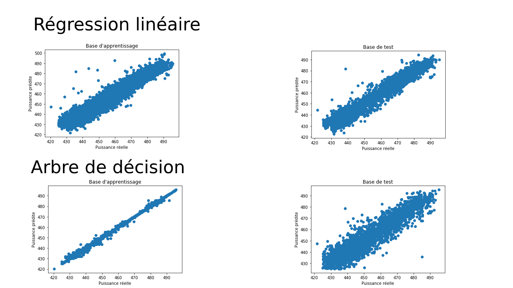
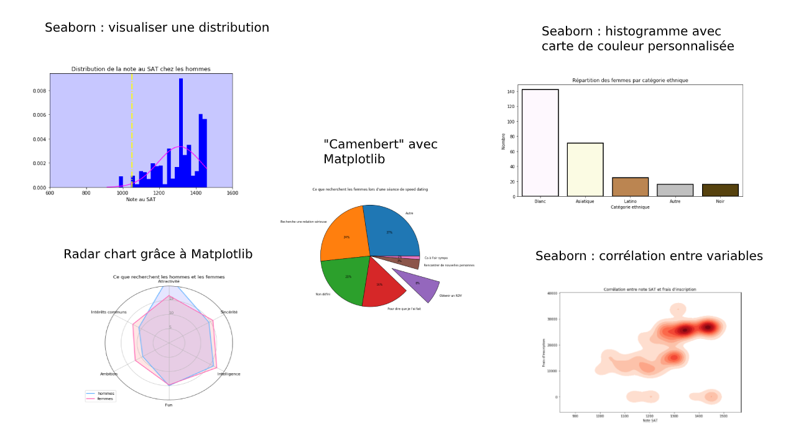

# Portfolio Data Science
Ce document présente l'ensemble des projets réalisés lors de ma formation de Data Scientist. Il permet de donner un aperçu des outils que j'ai appris et que j'ai eu l'occasion de mettre en oeuvre.
## 

## Prédire les performances d'une centrale électrique
Mon premier projet Data Science. A l'issue de 10 jours de formation "fondamentaux", j'ai choisi de rester dans le domaine au sein duquel j'ai travaillé pendant les 12 dernières années : les turbines à gaz.
L'objectif de ce projet était de prédire la puissance d'une centrale électrique en fonction de 4 paramètres :  
- la pression atmoshérique ambiante
- la température
- l'humidité
- la pression de vide au niveau du condenseur

J'ai pour ceci utilisé un modèle de régression linéaire ainsi qu'un arbre de décision. J'ai pu ainsi pour la 1° fois comparer deux modèles avec leurs avantages et inconvénients respectifs.  
Ce fut également ma première confrontation avec le phénomène "d'overfitting" comme le montrent les 2 graphes en bas de l'image ci-dessous (tracé valeur réelle / valeur prédites sur les bases d'apprentissage et de test). On voit bien dans ce cas que le modèle se comporte très bien sur le jeu de données d'apprentissage mais qu'il peine à être généralisé sur des données inconnues.  

Entre la régression linéaire qui ne sait pas prédire les "outliers" et l'arbre de décision qui parvient mal à généraliser ses prédictions, ce premier projet est une excellente illustration de la difficulté à obtenir le bon compromis biais / variance.

 
##  
## Data Mining
Il s'agissait d'analyser un jeu de données afin de définir la probabilité que 2 personnes décident de se revoir à l'issue d'une séance de speed dating.  
Pour ceci, je n'ai pas créé de modèle de prédiction mais eu recours à des méthodes traditionnelles de "data mining". Il s'agit d'utiliser différentes méthodes de visualisation de déterminer les relations entre variables.  
Même dans le cas où l'on souhaite modéliser un phénomène, cette étape est importante pour plusieurs raisons :  
- Elle permet d'identifier d'éventuelles relations de colinéarité entre variables explicatives qui peuvent nuire aux résultats d'un modèle.
- En identifiant des liens entre variables explicatives, on peut éventuellement éliminer certaines d'entre-elles et réduire la "dimensionnalité" du problème.
- De manière générale, il est toujours bon de se faire une idée du phénomène que l'on souhaite modéliser afin de détecter ultérieurement une éventuelle erreur dans le modèle.

 
